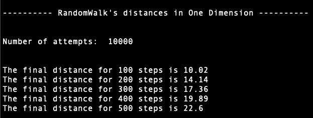
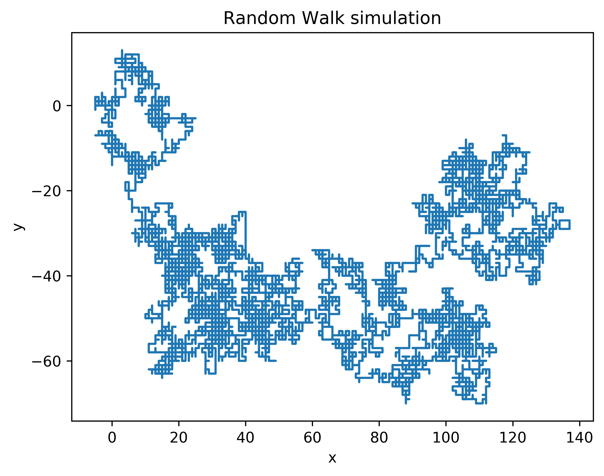

## Caminos Aleatorios

Los caminos aleatorios, son modelos computacionales que ejemplican la aleatoriedad en la dirección en que ocurre un proceso. 
Dado un punto de partida, los pasos siguientes son elegidos aleatoriamente de acuerdo a las opciones presentadas con igualdad
de probabilidad, obteniendo como resultado, gráficos sumamentes interesantes.

A continuación, se presentan los resultados obtenidos en una y dos dimensiones.

**Caminos aleatorios en 1D**

De acuerdo a Andrea Schmidt en [random walk](https://www.mit.edu/~kardar/teaching/projects/chemotaxis(AndreaSchmidt)/random.htm). 
Estando en 1D y tomando como punto de partida en 0, con direcciones de movimiento con igualdad de probabilidad dados por: 1 y -1,
la distancia final se aproxima a la raíz cuadrada de el número de pasos indicados. Esta descripción se puede visualizar mejor en 
el siguiente diagrama,

donde el punto inicial está en cero y termina en -2, entonces la distancia final desde el cero es de 2 unidades. 

La ecuación de arriba indica que la distancia final está en aproximadamente la raíz cuadrada de el número de pasos N, entonces, 
dado que se realizaron 6 pasos, la distancia final sería cercano a 2.44. 

En el programa implementado, se calcula la distancia final promedio dado cierta cantidad de intentos para un cierto número de pasos. 

**Caminos alestorios en 2D**

En dos dimensiones se realizó una simulación con 10000 pasos y se obtuvo el siguiente gráfico.

🥴 En muchos lugares podrás encontrar esta misma simulación con el nombre de camino de borrachos, describiendo la ruta que sigue una
persona con unas copas de más 🥴. 
